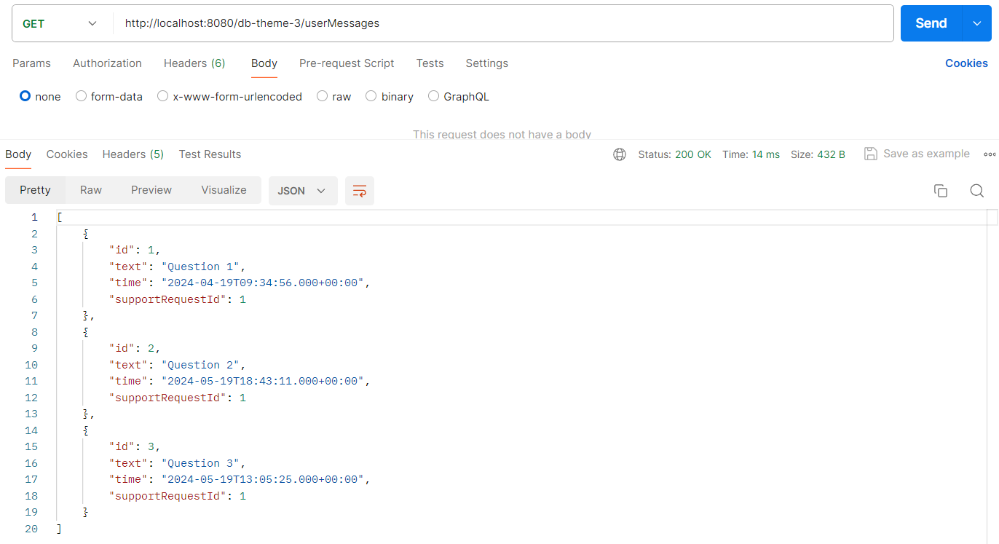
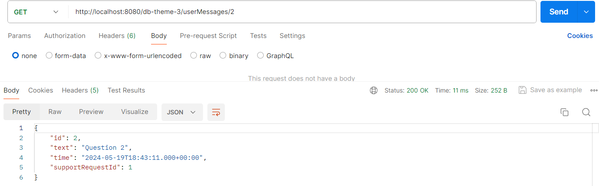
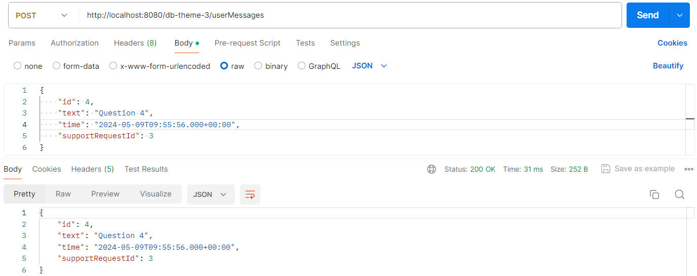
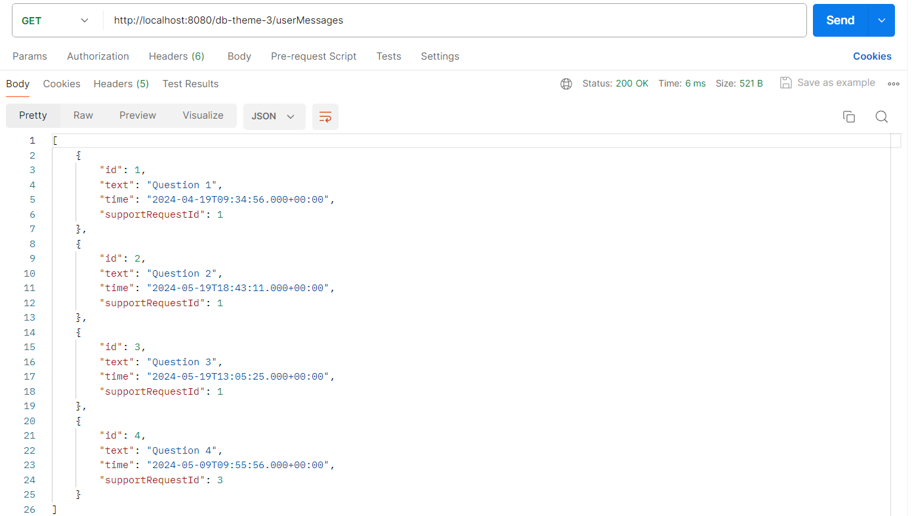
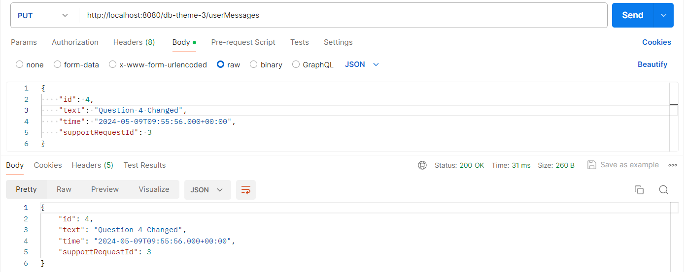
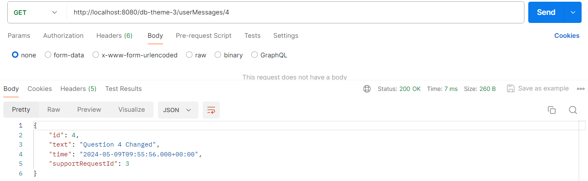
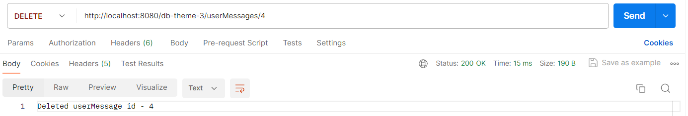

# Тестування працездатності системи

## GET

Запит та відповідь на отримання усіх UserMessage

Запит та відповідь на отримання первного UserMessage

## POST

Запит та відповідь

Перевірка за допомогою GET

## PUT

Запит та відповідь

Перевірка за допомогою GET

## DELETE

Запит та відповідь

Перевірка за допомогою GET

